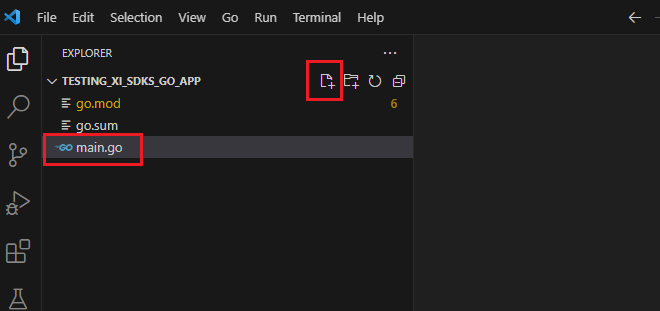

# XI SDK Quickstart for Go


[Repository GitHub](https://github.com/ingrammicro-xvantage/xi-sdk-resellers-go)

[SDK document](https://github.com/ingrammicro-xvantage/xi-sdk-resellers-go/tree/main/docs)

### Step 1: Create a new Go application
* You can create a new Go application with your preferred tool. The below guide is using [VS Code](https://code.visualstudio.com/Download). if you don’t have the environment set up yet, please follow [this guide](https://learn.microsoft.com/en-us/azure/developer/go/configure-visual-studio-code) to install and set up Go environment for VS Code.
* Create a folder for the application: `Testing_XI_SDKs_Go_App`
* Open VS code and point to the above folder.
* Hover to the root folder name on the left panel and click “create new file” icon to create a new `main.go`.



* Create a new module `Testing_XI_SDKs_Go_App`
* Open a new terminal window (<code>Ctrl+Shift+`</code>)
* Type `go mod init Testing_XI_SDKs_Go_App` → It should create a `go.mod` file.


### Step 2: Install XI SDK package and all dependencies to your project from Go Modules

* Open a new terminal window (<code>Ctrl+Shift+`</code>)
* Type: `go get -u github.com/ingrammicro-xvantage/xi-sdk-resellers-go`


### Step 3: Write a simple code to access the access token and product details endpoints.

[Access Token API](https://github.com/ingrammicro-xvantage/xi-sdk-resellers-go/blob/main/docs/AccesstokenAPI.md)

[Product API](https://github.com/ingrammicro-xvantage/xi-sdk-resellers-go/blob/main/docs/ProductCatalogAPI.md)

* Open the `main.go` file and paste the following code.

```go
package main

import (
	"context"
	"fmt"
	"os"

	xi_sdk_resellers "github.com/ingrammicro-xvantage/xi-sdk-resellers-go"
	"golang.org/x/oauth2"
)

func main() {
	baseUrl := "api.ingrammicro.com:443"
	clientId := "<PUT YOUR CLIENT ID HERE>"
	clientSecret := "<PUT YOUR CLIENT SECRET HERE>"
	imCustomerNumber := "20-222222"
	imCountryCode := "US"
	imCorrelationId := "fbac82ba-cf0a-4bcf-fc03-0c5084"
	imSenderId := "MyCompany"
	productNumber := "TSXML3"

	// Get Access Token
	tokenConfiguration := xi_sdk_resellers.NewConfiguration()
	tokenConfiguration.Host = baseUrl
	tokenApiClient := xi_sdk_resellers.NewAPIClient(tokenConfiguration)
	tokenResp, tokenR, tokenErr := tokenApiClient.AccesstokenAPI.GetAccesstoken(context.Background()).GrantType("client_credentials").ClientId(clientId).ClientSecret(clientSecret).Execute()
	if tokenErr != nil {
		fmt.Fprintf(os.Stderr, "Error when calling `AccesstokenAPI.GetAccesstoken``: %v\n", tokenErr)
		fmt.Fprintf(os.Stderr, "Full HTTP response: %v\n", tokenR)
		os.Exit(1)
	}
	accessToken := oauth2.Token{AccessToken: *tokenResp.AccessToken}

	// Get production details.
	ctx := context.Background()
	oauth2Conf := &oauth2.Config{}
	tokenResource := oauth2Conf.TokenSource(ctx, &accessToken)
	authContext := context.WithValue(ctx, xi_sdk_resellers.ContextOAuth2, tokenResource)
	productConfiguration := xi_sdk_resellers.NewConfiguration()
	productApiClient := xi_sdk_resellers.NewAPIClient(productConfiguration)
	productResp, productR, productErr := productApiClient.ProductCatalogAPI.GetResellerV6Productdetail(authContext, productNumber).IMCustomerNumber(imCustomerNumber).IMCountryCode(imCountryCode).IMCorrelationID(imCorrelationId).IMSenderID(imSenderId).Execute()
	if productErr != nil {
		fmt.Fprintf(os.Stderr, "Error when calling `ProductCatalogAPI.GetResellerV6Productdetail``: %v\n", productErr)
		fmt.Fprintf(os.Stderr, "Full HTTP response: %v\n", productR)
		os.Exit(1)
	}
	fmt.Println("Product Found")
	fmt.Fprintf(os.Stdout, "Ingram Part Number`: %v\n", productResp.GetIngramPartNumber())
	fmt.Fprintf(os.Stdout, "Customer Part Number`: %v\n", productResp.GetCustomerPartNumber())
	fmt.Fprintf(os.Stdout, "Vendor Name`: %v\n", productResp.GetVendorName())
	fmt.Fprintf(os.Stdout, "Vendor Part Number`: %v\n", productResp.GetVendorPartNumber())
	fmt.Fprintf(os.Stdout, "Product Category`: %v\n", productResp.GetProductCategory())
	fmt.Fprintf(os.Stdout, "Description`: %v\n", productResp.GetDescription())
}
```

* Replace your application information at the below section in the code:
    * Client ID 
    * Client Secret.
    * Your IM customer number
    * Your country code
    * Your Correlation ID
    * Your Sender ID
    * Product number to get the details.


### Step 4: Run the application

* Open terminal window (<code>Ctrl+Shift+`</code>) and type go run main.go

If everything is correct and the product exists, the console should return something like this.


 